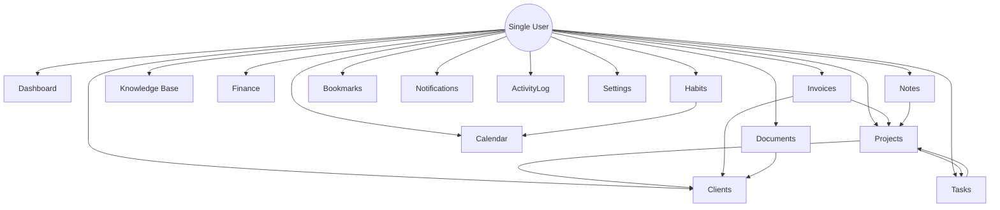

# Product Requirements Document (PRD)
## Project Workspace: Personal operating system for work

---

### 1. Executive Summary

**Workspace** is a private, single-user web application designed to serve as a personal operating system for work. It centralizes a developer's daily workflow—including project tracking, client records, task management, document storage, financial logging, bookmark organization, and a personal knowledge base—into a single, highly optimized web application. 

By design, Workspace is **not** a SaaS, CRM, ERP, or team collaboration tool. It has zero multi-user features, no organizations, and no complex permission systems. Instead, it is an integrated, keyboard-friendly digital environment built to minimize context switching, maximize focus, and provide a premium productivity experience for a single developer.

---

### 2. Product Vision

Workspace is conceived as a digital "second brain." For a developer, a typical workday involves bouncing between project management tools (Linear/Jira), note-taking apps (Notion/Obsidian), task managers (TickTick/Todoist), finance spreadsheets, calendar events, and email. This constant fragmentation causes cognitive friction, context-switching latency, and scattered data.

The vision for Workspace is to consolidate these capabilities into one clean, minimal, and premium interface. It is the first application the user opens in the morning and the last one closed at night. It is designed to feel as fast and keyboard-navigable as a command-line interface, while retaining the elegant visual aesthetics of modern applications like Linear and Craft.

---

### 3. Product Goals

*   **Zero Context Switching:** Bring daily tasks, client records, meeting agendas, bookmarks, and finance tracking into a single unified web app.
*   **High Performance & Latency Reduction:** Ensure instantaneous page navigation, quick searches, and command execution (under 100ms response times) to respect the user's flow.
*   **Data Sovereignty and Security:** Host sensitive contracts, documents, and financial records locally or in private S3 buckets.
*   **Minimalist & Premium UI:** Build a dark-mode-first aesthetic with generous whitespace, elegant typography, and micro-animations that make daily logging enjoyable.
*   **Keyboard-First Navigation:** Minimize mouse clicks through a central Command Palette (`Cmd+K` or `Ctrl+K`) and global keyboard shortcuts.

---

### 4. Problem Statement

*   **Fragmentation of Workspace Context:** Developers lose time searching for context across bookmarks, README files, Jira tasks, code snippets, local text files, and calendar items.
*   **Privacy Concerns:** Storing sensitive information and private server IP lists on public cloud services poses security risks. A self-hosted, personal application offers absolute control over data.
*   **SaaS Fatigue:** Most CRM, ERP, and task managers are bloated with team-collaboration features (comment tagging, permission sets, activity feeds) that are useless for a solo operator and clutter the UI.
*   **Lack of Integration Between Modules:** Standard tools do not connect client records with invoices or financial income records with client records automatically.

---

### 5. User Persona

#### The Solo Operator / Full-Stack Developer
*   **Name:** Alex (Staff Software Engineer / Freelance Developer)
*   **Needs:** High-speed task logging, instant code snippet retrievals, quick client billing, and structured wiki sheets.
*   **Tech Literacy:** Extremely high. Alex prefers keyboard shortcuts over mouse navigation, values markdown for formatting, and expects robust API-driven automation.
*   **Aesthetic Preferences:** Sleek dark themes, clean monospace typography where appropriate, minimal borders, high-contrast layouts, and glassmorphism.

---

### 6. User Journey

#### Scenario: The Morning Routine & Client Handoff
1.  **08:00 AM - Bootup:** Alex opens `workspace.local`. The Dashboard presents "Today's Tasks", upcoming deadlines, active projects, and a summary of monthly income vs. subscriptions.
2.  **08:15 AM - Command Palette Search:** Alex presses `Cmd+K`, types "Client A Docs", and immediately opens the document folder for *Client A* without opening a separate browser tab.
3.  **09:30 AM - Task Updates:** Alex opens the Kanban board under Tasks, updates the status of the "API Gateway Refactor" task, and links it to a Project milestone.
4.  **11:00 AM - Client Call & Document Stashing:** During a call with *Client B*, Alex opens Notes, jotting down details in markdown. Alex then uploads the signed retainer contract directly to the Documents module under the `Client B` folder.
5.  **04:00 PM - Invoice Generation & Finance Logging:** Alex completes a major milestone for *Client A*. Using the Invoices module, Alex drafts an invoice, generates a PDF, registers it as pending, and automatically appends a new projected income record to the Finance tracker. Alex triggers a Telegram message to send the PDF file link.

---

### 7. Product Principles

1.  **Simplicity Over Scale:** If a feature is only useful for teams (e.g., mention notifications, audit trails of who made a change, permission roles), discard it.
2.  **Keyboard Efficiency First:** Every major action—creating a task, jumping to notes—must be executable via keyboard shortcuts or the command palette.
3.  **Speed is a Feature:** The interface must feel instantaneous. Use Inertia partial reloads, Redis caching, and front-end optimistic updates to eliminate load delays.
4.  **Cohesion, Not CRUD:** Sibling modules must talk to each other. Notes can reference Projects; Invoices must link to Clients.
5.  **Premium Craftsmanship:** Interface styling must be refined. Use Tailwind CSS 4 variables, custom HSL palettes, subtle blur backdrops, and Outfit/Inter fonts.

---

### 8. Information Architecture



---

### 9. Navigation Structure

Workspace utilizes a collapsible, dual-state Navigation Layout:
1.  **Sidebar Mode:** A permanent left-hand navigation panel containing:
    *   **User Profile & Status Indicator** (Database connected, active jobs, local time).
    *   **Global Command Trigger:** Visual hint showing `Cmd+K`.
    *   **Core Workflows:** Dashboard, Tasks (Kanban/List), Calendar.
    *   **Knowledge & Notes:** Notes (Markdown), Wiki (Knowledge Base), Bookmarks.
    *   **Management:** Projects, Clients, Documents.
    *   **Ops & Security:** Activity Log.
    *   **Financials:** Finance, Invoices.
    *   **System:** Settings.
2.  **Focus Mode:** Triggered via `Cmd+F`. Hides the sidebar completely, maximizing screenspace for Markdown writing (Notes/Wiki) or Task kanban.
3.  **Command Palette Overlay:** Instantly triggered via `Cmd+K` from any view. Renders a modal overlay centered on screen, indexing all routes, project names, notes, and tasks.

---

### 10. Module Specifications

---

#### 10.1 Dashboard

##### Purpose
Serves as the high-density landing view, aggregating vital indicators, quick entries, and immediate timelines for the developer's day.

##### Features
*   **Greeting & Context:** Displays current date, day, and a random coding quote or motivational micro-text.
*   **Today's Schedule:** Integrated widget displaying today's calendar events and deadlines.
*   **Active Tasks Widget:** Checklist of tasks due today or overdue, with direct status toggle.
*   **Quick Notes Card:** Scratchpad area using a clean, auto-saving text field.
*   **Invoice Tracker Widget:** Summary of pending, paid, and overdue invoices.
*   **Statistics Ring:** Clean SVGs depicting monthly income vs. target, task completion ratios, and server health checks (via ping integrations).
*   **Quick Action Drawer:** Buttons for "New Task", "New Note", "New Invoice".

##### User Flow
1. User loads `workspace.local`.
2. Views overdue tasks in the list, clicks the checkbox to mark one complete.
3. Types a quick link or thought into the Quick Notes card; data saves asynchronously on keypress pause (500ms debounce).
4. Clicks "New Invoice" in Quick Actions, opening the invoice draft overlay.

##### Database Entities
No dedicated `Dashboard` table. It queries other modules (Tasks, Calendar, Invoices, Notes) using aggregated Eloquent relations.

##### Validation Rules
*   *Quick Notes Debounced Save:* `content` -> `nullable|string|max:5000`

##### Future Improvements
*   Integration with local system metrics (CPU/RAM of the server running Workspace).

##### UX Recommendations
*   Utilize a modular CSS grid layout allowing drag-and-drop widget resizing.
*   Apply high-contrast text tags for deadlines (e.g., amber for < 48 hours, crimson for overdue).

---

#### 10.2 Projects

##### Purpose
Centralize code links, environments, production states, and tracking details for active developer contracts or side projects.

##### Features
*   **Repository Integration:** Links to GitHub, GitLab, or local directories.
*   **Environment Overview:** Displays IP addresses, domain names, SSH ports, and links to production/staging environments.
*   **Milestones Tracker:** Interactive visual timeline showing delivery markers.
*   **Project-Specific Document Vault:** Direct list of documents tagged with this project.
*   **Progress Indicators:** Graphical progress bar calculated from task completion percentages.

##### User Flow
1. User clicks "Projects" in the sidebar.
2. Selects "Workspace App" from the project list card.
3. Views staging URL, clicks the "Copy IP" button next to server environments.
4. Adds a new milestone: "Phase 1 Beta Launch" due in two weeks.

##### Database Entities
*   `projects`: `id`, `name`, `slug`, `description`, `repository_url`, `production_url`, `staging_url`, `status` (active, archived, pipeline), `progress_percent`, `timestamps`
*   `project_milestones`: `id`, `project_id`, `title`, `due_date`, `completed_at`, `status` (pending, completed), `timestamps`

##### Relationships
*   `Project` hasMany `Milestone`
*   `Project` belongsTo `Client` (nullable for personal projects)
*   `Project` hasMany `Task`
*   `Project` hasMany `Document`
*   `Project` hasMany `Credential`

##### Validation Rules
*   `name`: `required|string|max:255`
*   `repository_url`: `nullable|url`
*   `production_url`: `nullable|url`
*   `staging_url`: `nullable|url`
*   `status`: `required|in:active,archived,pipeline`

##### Future Improvements
*   Auto-fetch repository activity (commits, active branches) using GitHub REST APIs.

##### UX Recommendations
*   Use a card-grid layout for the dashboard of projects with micro-logos generated from initials or favicon fetches of the production URLs.

---

#### 10.3 Clients

##### Purpose
Manage billing info, history, contact detail, and records of individuals or companies paying for developer services.

##### Features
*   **Core Information Profile:** Client company name, representative name, business tax ID, address.
*   **Contact Info:** Direct email, phone, and messaging links (Telegram/Slack).
*   **Client Project History:** Lists all historical and ongoing projects.
*   **Invoicing Records:** Aggregates paid, unpaid, and total lifetime client value metrics.
*   **Personal Notes Area:** Simple Rich Text area for logging business terms, client preferences, or communications.

##### User Flow
1. User navigates to Clients, clicks "Add Client".
2. Fills in tax details and email address.
3. Views the Client profile page to see all invoices associated with that client.

##### Database Entities
*   `clients`: `id`, `name`, `company_name`, `email`, `phone`, `tax_id`, `billing_address`, `notes`, `timestamps`

##### Relationships
*   `Client` hasMany `Project`
*   `Client` hasMany `Invoice`

##### Validation Rules
*   `name`: `required|string|max:255`
*   `email`: `required|email|max:255`
*   `tax_id`: `nullable|string|max:100`

##### Future Improvements
*   Integration with public company registry API to auto-fill billing addresses based on tax ID.

##### UX Recommendations
*   A clean split-pane design: Left pane is list of clients, right pane shows selected client details, projects list, and billing charts.

---

#### 10.4 Tasks

##### Purpose
Provide high-fidelity project management using Kanban and List interfaces for tracking individual work items.

##### Features
*   **Multi-View Support:** Seamless hotkey toggle between Kanban board (columns: Todo, In Progress, Blocked, Done) and a flat list.
*   **Rich Task Detail:** Supports priority weights (low, medium, high, urgent), custom labels, and due dates.
*   **Subtask Checklist:** Inner list within a task showing checkbox completions.
*   **Attachments & Comments:** Secure local uploads of design specs or logs, and a notes/comment thread.
*   **Recurring Tasks Engine:** Configurable settings to auto-regenerate tasks daily, weekly, or monthly.

##### User Flow
1. User views Kanban board, drags "Refactor Auth" card from "Todo" to "In Progress".
2. Hits `Enter` on the card to open detail view; adds subtask: "Update Fortify routes".
3. Assigns label "Security" and sets due date to tomorrow.

##### Database Entities
*   `tasks`: `id`, `project_id` (nullable), `title`, `description`, `status` (todo, in_progress, blocked, done), `priority` (low, medium, high, urgent), `due_date`, `is_recurring`, `recurrence_rule` (cron format/enum), `completed_at`, `timestamps`
*   `task_checklists`: `id`, `task_id`, `item_text`, `is_completed`, `sort_order`, `timestamps`
*   `task_attachments`: `id`, `task_id`, `file_path`, `file_name`, `file_size`, `timestamps`

##### Relationships
*   `Task` belongsTo `Project` (nullable)
*   `Task` hasMany `TaskChecklist`
*   `Task` hasMany `TaskAttachment`

##### Validation Rules
*   `title`: `required|string|max:255`
*   `status`: `required|in:todo,in_progress,blocked,done`
*   `priority`: `required|in:low,medium,high,urgent`
*   `due_date`: `nullable|date`

##### Future Improvements
*   Automated ticket synchronization with external GitHub Issues.

##### UX Recommendations
*   Utilize smooth drag-and-drop libraries (`@shopify/draggable` or custom HTML5 Drag/Drop in Vue).
*   Add a visual indicator of due date urgency via changing color borders on card faces.

---

#### 10.5 Calendar

##### Purpose
Visualizes time-based deliverables, client meetings, project launch schedules, and personal reminders on monthly, weekly, and daily grids.

##### Features
*   **Unified Schedule:** Merges client milestones, task deadlines, and calendar events into one dashboard.
*   **Recurring Events Manager:** Set recurring calendar entries for weekly syncs or standups.
*   **Telegram integration:** Sends reminder notifications for upcoming calendar entries 15 minutes before the start time.

##### User Flow
1. User navigates to Calendar, clicks a day square.
2. Form overlay prompts for event name: "Client Sync", start/end times, and reminder preference.
3. Saves, and the event populates the monthly grid instantly.

##### Database Entities
*   `calendar_events`: `id`, `title`, `description`, `start_time`, `end_time`, `is_all_day`, `is_recurring`, `recurrence_rule`, `reminder_lead_time_minutes`, `timestamps`

##### Relationships
*   `CalendarEvent` optionally belongsTo `Project` or `Client`

##### Validation Rules
*   `title`: `required|string|max:255`
*   `start_time`: `required|date`
*   `end_time`: `required|date|after_or_equal:start_time`

##### Future Improvements
*   Bidirectional CalDAV or Google Calendar sync to fetch phone-scheduled events automatically.

##### UX Recommendations
*   A fluid, CSS grid-based layout that mimics the aesthetics of Apple Calendar or Sunrise calendar.
*   Allow resizing of events by dragging bottom edges on the week/day views.

---

#### 10.6 Notes

##### Purpose
Provide a markdown-native, folders-and-tags based writing module for quick thoughts, scratchpads, and unstructured ideas.

##### Features
*   **Markdown WYSIWYG Editor:** Interleaved Markdown parsing using Milkdown or TipTap, showing clean formatting.
*   **Bidirectional Linking (Backlinks):** Mention notes using obsidian-like `[[Note Name]]` syntax.
*   **Folders & Tagging:** Nested hierarchies and search filters.
*   **Auto-save & Version History:** Periodic backups saved to PostgreSQL database as modifications happen.

##### User Flow
1. User presses `Cmd+K`, types "New Note".
2. Typings start in full screen. User writes `# Redis Tuning Guidelines` and links it to `[[Workspace App]]`.
3. System automatically creates a backlink in the "Workspace App" project notes.

##### Database Entities
*   `notes`: `id`, `title`, `slug`, `content`, `folder_id` (nullable), `is_archived`, `is_favorite`, `timestamps`
*   `folders`: `id`, `name`, `parent_id` (nullable), `timestamps`
*   `note_backlinks`: `id`, `source_note_id`, `target_note_id`, `timestamps`

##### Relationships
*   `Note` belongsTo `Folder` (nullable)
*   `Note` belongsToMany `Tag`
*   `Note` hasMany `NoteBacklink` (as source and target)

##### Validation Rules
*   `title`: `required|string|max:255`
*   `content`: `nullable|string`

##### Future Improvements
*   Offline sync with LocalStorage backup if connection drops.

##### UX Recommendations
*   Keep the page styling clean: center-focused reading lane, hidden sidebars, serif font option for deep reading, and a live word count.

---

#### 10.7 Knowledge Base

##### Purpose
Organize long-term technical documentation, server architectures, deployment scripts, and reference wikis.

##### Features
*   **Structured Wiki Pages:** Hierarchical articles focusing on technical documentation.
*   **Snippet Repository:** Multi-language syntax-highlighted code drawer (supporting copy-to-clipboard).
*   **Deployment Manuals Checklist:** Steps for manual setups with integrated copy-to-clipboard blocks for terminal commands.

##### User Flow
1. User navigates to Knowledge Base.
2. Clicks "Server Configs" subdirectory, opens "PostgreSQL Backup Script".
3. Copies the shell script directly via a single click of the code snippet copy button.

##### Database Entities
*   `kb_articles`: `id`, `title`, `slug`, `content`, `parent_article_id` (nullable), `category` (deployment, server, logic, general), `timestamps`

##### Relationships
*   `KbArticle` hasMany child articles (`parent_article_id` hierarchy)
*   `KbArticle` belongsToMany `Tag`

##### Validation Rules
*   `title`: `required|string|max:255`
*   `content`: `required|string`
*   `category`: `required|string`

##### Future Improvements
*   Import static documentation folders containing standard markdown directly from GitHub.

##### UX Recommendations
*   A left-hand structural tree navigation, similar to GitBook or Readme.io, with a sticky right-side page table-of-contents.

---

#### 10.8 Documents

##### Purpose
Securely store and organize business contracts, invoices received, PDF reports, assets, and design files.

##### Features
*   **Hierarchical File Manager:** Standard nesting folders.
*   **Inline File Previewer:** Native browser rendering of PDFs, images, text, and videos directly without downloading.
*   **Version Control History:** Allows uploading revisions to the same document file node.
*   **S3/Local Storage Adaptability:** Easily transition document physical storage files from local disk to S3 arrays via config.

##### User Flow
1. User enters Documents page, navigates to `/Contracts/2026`.
2. Drags `retainer_agreement_v2.pdf` onto the window.
3. System uploads the file to `storage/documents`, creates database entry, and generates an image preview.

##### Database Entities
*   `documents`: `id`, `name`, `file_path`, `mime_type`, `file_size`, `folder_id` (nullable), `project_id` (nullable), `version`, `timestamps`

##### Relationships
*   `Document` belongsTo `Folder` (nullable)
*   `Document` belongsTo `Project` (nullable)

##### Validation Rules
*   `file`: `required|file|max:51200` (50MB maximum size limit)
*   `name`: `required|string|max:255`

##### Future Improvements
*   OCR engine (via Tesseract/local queues) to scan text within uploaded PDFs, making document contents searchable.

##### UX Recommendations
*   Grid layout using folder/file icons with detailed attributes (size, date uploaded) and hover popups for instant previews.

---

#### 10.9 Credentials

##### Purpose
Provide a secure, locally encrypted vault for SSH keys, database credentials, API tokens, and server passwords.

##### Features
*   **Data Encryption:** Sensitive database fields are automatically encrypted at rest using AES-256-GCM.
*   **Secret Masking:** Hidden fields by default; clicking eye icons or utilizing key bindings copies raw values to the clipboard.
*   **Expiration Warnings:** Track date profiles of tokens/keys and fire warning alerts when approaching dates.
*   **Cloudflare/GitHub Token Templates:** Forms designed to hold specific parameters for popular services.

##### User Flow
1. User enters Credentials tab, inputs the primary application master password to unlock decryption.
2. Selects "GitHub Access Token", clicks the "Copy" icon.
3. The raw decrypted string copies to clipboard, and a notification logs the read in the Activity Log.

##### Database Entities
*   `credentials`: `id`, `title`, `category` (ssh, api_key, server, db, cloudflare, github, other), `host` (nullable), `username` (nullable), `encrypted_secret`, `expires_at`, `notes`, `timestamps`

##### Relationships
*   `Credential` optionally belongsTo `Project`

##### Validation Rules
*   `title`: `required|string|max:255`
*   `encrypted_secret`: `required|string`
*   `category`: `required|in:ssh,api_key,server,db,cloudflare,github,other`

##### Future Improvements
*   Browser extension integration to autofill credentials onto development sites.

##### UX Recommendations
*   A strict security timeout: credentials automatically lock after 5 minutes of inactivity, requiring user re-authentication.

---

#### 10.9 Finance

##### Purpose
Track professional income, business expenses, software subscriptions, and tax reserves without accounting complexity.

##### Features
*   **Double-Entry Log:** Record items as either income (credited) or expense (debited).
*   **Subscription Monitor:** Track recurring software fees, rendering monthly costs and renewal date reminders.
*   **Tax Projection Estimates:** Set a target tax withholding percentage (e.g., 30%) and display projected tax owed.
*   **Financial Aggregations:** Interactive charts for income vs. outflow on yearly/monthly splits.

##### User Flow
1. User buys a subscription to an API, clicks "Add Expense".
2. Inputs: "OpenAI API", amount, select category "Software", check "Recurring Subscription".
3. System charts update to show new projected monthly run rates.

##### Database Entities
*   `finance_transactions`: `id`, `type` (income, expense), `amount` (decimal 10,2), `category`, `transaction_date`, `is_recurring`, `recurrence_period` (monthly, annual), `client_id` (nullable), `description`, `timestamps`

##### Relationships
*   `FinanceTransaction` belongsTo `Client` (nullable)

##### Validation Rules
*   `type`: `required|in:income,expense`
*   `amount`: `required|numeric|min:0.01`
*   `transaction_date`: `required|date`

##### Future Improvements
*   CSV/OFX transaction imports from banks.

##### UX Recommendations
*   Use standard financial color semantics: green highlights for income, subtle muted shades for expenses. Avoid red overload to maintain a calm dashboard.

---

#### 10.10 Invoice

##### Purpose
Quick draft and creation of PDF client invoices, providing simple delivery and payment tracking.

##### Features
*   **Line Item Draft Editor:** Real-time billing calculators for hours, flat-rate items, and taxes.
*   **PDF Compiler:** Clean, minimal PDF print-template generation using standard CSS layouts.
*   **Status Management:** Labels for "Draft", "Sent", "Overdue", "Paid".
*   **Direct Reference:** Links client profiles directly, pulling billing address and tax identification fields automatically.

##### User Flow
1. User clicks "Generate Invoice" from Client profile.
2. Fills in hours: "15 hours at $100/hr", flat rate item: "Design asset kit".
3. Clicks "Preview PDF" to view output. Clicks "Finalize & Send" to flag it as "Sent" and export the PDF.

##### Database Entities
*   `invoices`: `id`, `invoice_number` (unique string), `client_id`, `project_id` (nullable), `issue_date`, `due_date`, `tax_rate`, `subtotal`, `total`, `status` (draft, sent, overdue, paid), `timestamps`
*   `invoice_items`: `id`, `invoice_id`, `description`, `quantity`, `unit_price`, `total`, `timestamps`

##### Relationships
*   `Invoice` belongsTo `Client`
*   `Invoice` belongsTo `Project` (nullable)
*   `Invoice` hasMany `InvoiceItem`

##### Validation Rules
*   `invoice_number`: `required|string|unique:invoices`
*   `client_id`: `required|exists:clients,id`
*   `issue_date`: `required|date`
*   `due_date`: `required|date|after_or_equal:issue_date`

##### Future Improvements
*   Automated email delivery with payment gateway integration (Stripe payment link embedding).

##### UX Recommendations
*   The invoice editor should mirror Obsidian's live preview; clicking values lets the user type in-place, reducing form clutter.

---

#### 10.11 Bookmarks

##### Purpose
Save and organize programming documentation, reference guides, design tools, and educational videos.

##### Features
*   **Categorized bookmark system:** Folders, tags, and source types (documentation, tool, video, article, other).
*   **Link Meta Fetcher:** Auto-scrapes page title, description, and preview icons when saving.
*   **Elastic Full-text Search:** Quick query match against bookmark descriptions and titles.

##### User Flow
1. User pastes `https://laravel.com/docs/13.x/eloquent` into the quick-bookmark drawer.
2. Background task fetches metadata, saving title: "Eloquent ORM - Laravel" and tags it as "Documentation".
3. The bookmark appears in the dev bookmarks stack.

##### Database Entities
*   `bookmarks`: `id`, `url`, `title`, `description`, `preview_image_url`, `type` (documentation, tool, video, article, other), `timestamps`

##### Relationships
*   `Bookmark` belongsToMany `Tag`

##### Validation Rules
*   `url`: `required|url|max:1000`
*   `title`: `nullable|string|max:500`

##### Future Improvements
*   Chrome/Arc Browser extension to save bookmarks to Workspace in one click.

##### UX Recommendations
*   A card grid layout showing rich snippet previews, titles, descriptions, and a quick "Open Link" arrow button.

---

#### 10.12 Notifications

##### Purpose
Aggregate in-app indicators and coordinate external alerts (Telegram, Email) for task deadlines and invoice statuses.

##### Features
*   **Reminder Center:** A dedicated panel in the app displaying notification records.
*   **Notification Channels:**
    *   *In-App:* Instant Toast alerts and indicator badges.
    *   *Telegram:* Bot integration pushing message summaries.
    *   *Email:* Periodic summaries or critical system notifications.
*   **Granular System Triggers:** Turn channels on/off for specific triggers.

##### User Flow
1. User sets task deadline: "Deploy Beta" due at 5:00 PM.
2. At 4:45 PM, a scheduled cron task triggers.
3. System fires a Telegram message: `Reminder: "Deploy Beta" is due in 15 minutes.` and adds an in-app notification item.

##### Database Entities
Uses Laravel's default `notifications` table structure:
*   `notifications`: `uuid`, `type`, `notifiable_type`, `notifiable_id`, `data` (JSON), `read_at`, `timestamps`

##### Relationships
*   `Notification` morphsTo `Notifiable` (which is the single `User` model)

##### Validation Rules
No standard input forms; internal controller validates configuration states.

##### Future Improvements
*   Real-time pushes via WebSockets (Laravel Reverb) to instantly show in-app reminders without page refreshes.

##### UX Recommendations
*   A clean slide-out notification center drawer from the top right, with single-click "Clear All" capability.

---

#### 10.13 Activity Log

##### Purpose
Provide a transparent, audit-ready timeline of all operations, mutations, and database queries performed inside the system.

##### Features
*   **Log Everything:** Track creations, edits, deletions, login events, and credential access.
*   **Details Snapshot:** Store JSON payloader snapshots of record states before and after mutations.
*   **Activity Timeline:** High-density scrollable list showing chronological steps.

##### User Flow
1. User deletes a client record.
2. The system triggers an observer, creating a row in the Activity Log detailing the deletion, timestamp, and user IP.
3. User visits Activity Log later to review when the action took place.

##### Database Entities
*   `activity_logs`: `id`, `action` (created, updated, deleted, viewed_credentials, logged_in), `subject_type`, `subject_id`, `payload` (JSON), `ip_address`, `timestamps`

##### Relationships
*   `ActivityLog` morphsTo `Subject` (polymorphic relationship to log actions against any model).

##### Validation Rules
*   System generated. No direct user-facing forms.

##### Future Improvements
*   Log exporting functionality in JSON and CSV formats for records matching search filters.

##### UX Recommendations
*   Monospace-styled timeline items showing concise summaries: `[2026-07-14 15:40] CREDENTIALS: ssh-key-1 decrypted by user (IP: 127.0.0.1)`.

---

#### 10.14 Settings

##### Purpose
Provide control over security keys, profiles, interface preferences, backup executions, and external bot links.

##### Features
*   **Profile Setup:** Single-user name, email, secure password settings.
*   **Theme Controls:** Toggle dark, light, or system themes.
*   **Telegram Bot Setup:** Credentials and test ping buttons to establish bot messaging channels.
*   **Manual & Auto Backup Configuration:** Trigger instant database dumps to configured S3 storage.

##### User Flow
1. User navigates to Settings -> Integrations.
2. inputs Telegram Bot Token and chat ID, clicks "Send Test Notification".
3. Receives a verification message on Telegram, confirming connection.

##### Database Entities
*   `settings`: `id`, `key` (unique string index), `value` (JSON/text), `timestamps`

##### Validation Rules
*   `profile.email`: `required|email|max:255`
*   `settings.telegram_bot_token`: `nullable|string`

##### Future Improvements
*   Integration with system services (e.g., Docker commands) to restart background queues directly from UI.

##### UX Recommendations
*   Standard left-rail settings tabs (Profile, Theme, Integrations, Backups) with modern CSS transition states.

---

#### 10.15 Habit Tracker

##### Purpose
Provide an interactive routine tracker to log and monitor daily habits, completion histories, and positive streaks.

##### Features
*   **Habit Configurations:** Create, edit, and delete habits with custom descriptions and activation settings.
*   **Flexible Frequencies:** Support daily tracking, specific days of the week (e.g. Mon, Wed, Fri), or custom weekly counts.
*   **Streak Calculator:** Compute current consecutive completion streaks and all-time best records.
*   **GitHub-Style Grid:** A clean contribution visual grid displaying a heatmap of habit completion frequency over the last 365 days.
*   **One-Click Check-in:** A fast toggle interface to mark habits complete for the day.
*   **Telegram reminders:** Remind the user of incomplete habits at a customizable time before the end of the day.

##### User Flow
1. User clicks "Habits" in the sidebar.
2. Selects "New Habit", enters "Read Codebases", sets frequency to "Every day".
3. System inserts the habit into the daily checklist.
4. User clicks checkmark today, increasing current streak from 3 to 4, and the heatmap lights up for today's date.

##### Database Entities
*   `habits`: `id`, `name`, `description` (nullable), `frequency_type` (daily, weekly, custom_days), `frequency_days` (JSON, nullable), `streak_current`, `streak_longest`, `is_active`, `archived_at`, `timestamps`
*   `habit_logs`: `id`, `habit_id`, `completed_date`, `notes` (nullable), `timestamps`

##### Relationships
*   `Habit` hasMany `HabitLog`

##### Validation Rules
*   `name`: `required|string|max:255`
*   `frequency_type`: `required|in:daily,weekly,custom_days`
*   `frequency_days`: `nullable|array`
*   `completed_date`: `required|date`

##### Future Improvements
*   Data export to JSON formats, and external REST webhook triggers when a streak hits milestones (e.g., 100 days).

##### UX Recommendations
*   Include a high-density, horizontal color-coded contribution calendar grid and subtle hover summaries showing completing stats for that date.

---

### 11. Feature Breakdown

| Module | Feature Name | Priority | Complexity | Impact | Target Release |
| :--- | :--- | :--- | :--- | :--- | :--- |
| **Dashboard** | Daily Tasks & Schedule Widgets | P0 | Low | High | MVP |
| **Dashboard** | Quick Actions Drawer | P1 | Low | Medium | MVP |
| **Projects** | Environment IP & Port Vault | P0 | Low | High | MVP |
| **Projects** | Milestone Tracker | P1 | Medium | Medium | V1 |
| **Clients** | Core Company & Billing Profile | P0 | Low | High | MVP |
| **Tasks** | Kanban & Drag-Drop UI | P0 | Medium | High | MVP |
| **Tasks** | Subtask checklist | P0 | Low | Medium | MVP |
| **Tasks** | Recurring Tasks Engine | P1 | High | Medium | V1 |
| **Calendar** | Monthly Grid View | P1 | Medium | Medium | V1 |
| **Notes** | TipTap Markdown Live Preview | P0 | Medium | High | MVP |
| **Notes** | Bidirectional Wiki Links | P1 | High | Medium | V1 |
| **KB** | Article Tree Layout & Snippets | P0 | Low | Medium | MVP |
| **Documents** | File Explorer & Upload to local/S3 | P1 | Medium | High | V1 |
| **Credentials**| AES-256 Secret Encryption Vault | P0 | High | Critical | MVP |
| **Finance** | Income/Expense Ledger | P0 | Low | High | MVP |
| **Invoice** | PDF Generator (CSS print template)| P0 | Medium | High | MVP |
| **Bookmarks** | Page Crawler & Metadata Fetch | P2 | Medium | Low | V1 |
| **Notifications**| Telegram Bot Integrator & DB Alerts | P0 | Medium | High | MVP |
| **Activity Log**| observer-based Database Logger | P1 | Low | Medium | V1 |
| **Settings** | Backup to S3 & General Prefs | P0 | Medium | High | MVP |
| **Habit Tracker**| Habit CRUD & Status Toggle | P0 | Low | High | MVP |
| **Habit Tracker**| Streak Calculations & Grid | P1 | Medium | Medium | V1 |
| **Habit Tracker**| Telegram Notification Reminders | P1 | Medium | High | V1 |

---

### 12. Functional Requirements

#### 12.1 Core System Logic
*   **Authentication Flow:** The application must block all requests unless a valid Laravel Sanctum session is authenticated. Only a single user can register; subsequent registrations are disabled once the primary account is active.
*   **Single-User Guard:** Middleware checks that user database queries match user ID `1`. No endpoints should support multi-tenant query params.

#### 12.2 Keyboard Navigation & Command Palette
*   **Global Command Palette (`Cmd+K` / `Ctrl+K`):** Instantly displays a modal popup containing a fuzzy search bar. This bar must search:
    1. Navigation routes (e.g., "Settings", "Kanban").
    2. Active projects, clients, tasks, and notes by title.
    3. Custom actions (e.g., "Add Expense", "New Task", "Lock Vault").
*   **Global Keyboard Shortcuts:**
    *   `g` then `t`: Go to Tasks.
    *   `g` then `n`: Go to Notes.
    *   `g` then `d`: Go to Dashboard.
    *   `Esc`: Close modals, drawers, or exit Focus Mode.
    *   `Cmd+S` (inside Notes/Wiki): Trigger manual save, bypassing auto-save debounces.

#### 12.3 Markdown Parsing & Rendering
*   Notes and Knowledge Base editor views must support live parsing of Markdown text. Raw input like `### Header` must dynamically transition to styled headers. Code segments must implement syntax highlighting (prismjs or shiki).

#### 12.4 Secure Local/S3 Storage
*   Document files and attachments must support storage in a local private directory or an S3 compatible storage array. File uploads must stream through chunked uploads if exceeding 10MB to prevent browser lock-ups.

#### 12.5 Telegram Bot Notification Engine
*   A background daemon monitors scheduled events. Notifications are pushed to Telegram using a webhook endpoint. If transmission fails, the engine retries up to three times with exponential backoff before logging a failure.

---

### 13. Non-Functional Requirements

#### 13.1 Performance
*   **Lighthouse Metrics:** Achieve 90+ across Performance, Accessibility, and Best Practices.
*   **Server Response Latency:** Inertia requests must complete in under 100ms for read operations and under 200ms for writes on local development environments.
*   **Optimistic UI Updates:** Task checking, bookmark additions, and quick edits must update the UI state instantly before receiving server status confirmations, rolling back gracefully if transactions fail.

#### 13.2 Security
*   **Data Security:** Ensure sensitive configurations, private keys, and personal logs are stored securely, using standard environment configurations and single-user isolation middleware to prevent unauthorized access.

#### 13.3 Accessibility
*   **WCAG 2.1 AA Compliance:** Full keyboard focus trapping on modal components, semantic HTML structures, and a minimum contrast ratio of 4.5:1 on text elements.
*   **Tab Navigation:** Ensure the entire application interface can be fully navigated and operated using only standard `Tab`, `Shift+Tab`, and `Enter` inputs.

#### 13.4 Scalability & Caching
*   **Query Indexing:** All primary foreign key columns, status enums, and slugs must have indexing constraints in PostgreSQL.
*   **Redis Integration:** Cache settings records, static articles, and active configurations in Redis. Utilize cache invalidation listeners on model updates.

#### 13.5 Logging & Diagnostics
*   **Laravel Pail Integration:** Ensure easy tailing of application log profiles directly within active terminal queues.
*   **Log Rotation:** Local application log files must enforce maximum storage rules (daily rotation, keeping at most 7 days of logs).

#### 13.6 Backup & Recovery
*   **Automated Backups:** Daily cron script executes `pg_dump`, encrypts the resulting SQL payload, and exports it to the configured S3 backup directory.
*   **Storage Limits:** Retain daily backups for 7 days, weekly for 4 weeks, and monthly for 12 months.

---

### 14. Suggested Database Domains

#### Schema Layout

```
users
- id (BIGINT, PK)
- name (VARCHAR)
- email (VARCHAR, UNIQUE)
- password (VARCHAR)
- timestamps

projects
- id (BIGINT, PK)
- client_id (BIGINT, FK -> clients.id, nullable)
- name (VARCHAR)
- slug (VARCHAR, UNIQUE)
- repository_url (VARCHAR, nullable)
- production_url (VARCHAR, nullable)
- staging_url (VARCHAR, nullable)
- status (VARCHAR: active, archived, pipeline)
- progress_percent (INT, default 0)
- timestamps

clients
- id (BIGINT, PK)
- name (VARCHAR)
- company_name (VARCHAR, nullable)
- email (VARCHAR)
- phone (VARCHAR, nullable)
- tax_id (VARCHAR, nullable)
- billing_address (TEXT, nullable)
- notes (TEXT, nullable)
- timestamps

tasks
- id (BIGINT, PK)
- project_id (BIGINT, FK -> projects.id, nullable)
- title (VARCHAR)
- description (TEXT, nullable)
- status (VARCHAR: todo, in_progress, blocked, done)
- priority (VARCHAR: low, medium, high, urgent)
- due_date (DATE, nullable)
- is_recurring (BOOLEAN, default false)
- recurrence_rule (VARCHAR, nullable)
- completed_at (TIMESTAMP, nullable)
- timestamps

task_checklists
- id (BIGINT, PK)
- task_id (BIGINT, FK -> tasks.id)
- item_text (VARCHAR)
- is_completed (BOOLEAN, default false)
- sort_order (INT, default 0)
- timestamps

task_attachments
- id (BIGINT, PK)
- task_id (BIGINT, FK -> tasks.id)
- file_path (VARCHAR)
- file_name (VARCHAR)
- file_size (INT)
- timestamps

calendar_events
- id (BIGINT, PK)
- project_id (BIGINT, FK -> projects.id, nullable)
- title (VARCHAR)
- description (TEXT, nullable)
- start_time (TIMESTAMP)
- end_time (TIMESTAMP)
- is_all_day (BOOLEAN, default false)
- is_recurring (BOOLEAN, default false)
- recurrence_rule (VARCHAR, nullable)
- reminder_lead_time_minutes (INT, nullable)
- timestamps

notes
- id (BIGINT, PK)
- folder_id (BIGINT, FK -> folders.id, nullable)
- title (VARCHAR)
- slug (VARCHAR, UNIQUE)
- content (TEXT, nullable)
- is_archived (BOOLEAN, default false)
- is_favorite (BOOLEAN, default false)
- timestamps

folders
- id (BIGINT, PK)
- name (VARCHAR)
- parent_id (BIGINT, FK -> folders.id, nullable)
- timestamps

note_backlinks
- id (BIGINT, PK)
- source_note_id (BIGINT, FK -> notes.id)
- target_note_id (BIGINT, FK -> notes.id)
- timestamps

kb_articles
- id (BIGINT, PK)
- title (VARCHAR)
- slug (VARCHAR, UNIQUE)
- content (TEXT)
- parent_article_id (BIGINT, FK -> kb_articles.id, nullable)
- category (VARCHAR: deployment, server, logic, general)
- timestamps

documents
- id (BIGINT, PK)
- folder_id (BIGINT, FK -> folders.id, nullable)
- project_id (BIGINT, FK -> projects.id, nullable)
- name (VARCHAR)
- file_path (VARCHAR)
- mime_type (VARCHAR)
- file_size (INT)
- version (INT, default 1)
- timestamps


finance_transactions
- id (BIGINT, PK)
- client_id (BIGINT, FK -> clients.id, nullable)
- type (VARCHAR: income, expense)
- amount (DECIMAL 10,2)
- category (VARCHAR)
- transaction_date (DATE)
- is_recurring (BOOLEAN, default false)
- recurrence_period (VARCHAR: monthly, annual, nullable)
- description (TEXT, nullable)
- timestamps

invoices
- id (BIGINT, PK)
- client_id (BIGINT, FK -> clients.id)
- project_id (BIGINT, FK -> projects.id, nullable)
- invoice_number (VARCHAR, UNIQUE)
- issue_date (DATE)
- due_date (DATE)
- tax_rate (DECIMAL 5,2, default 0.00)
- subtotal (DECIMAL 10,2)
- total (DECIMAL 10,2)
- status (VARCHAR: draft, sent, overdue, paid)
- timestamps

invoice_items
- id (BIGINT, PK)
- invoice_id (BIGINT, FK -> invoices.id)
- description (VARCHAR)
- quantity (DECIMAL 10,2)
- unit_price (DECIMAL 10,2)
- total (DECIMAL 10,2)
- timestamps

bookmarks
- id (BIGINT, PK)
- url (VARCHAR)
- title (VARCHAR, nullable)
- description (TEXT, nullable)
- preview_image_url (VARCHAR, nullable)
- type (VARCHAR: documentation, tool, video, article, other)
- timestamps

tags
- id (BIGINT, PK)
- name (VARCHAR, UNIQUE)
- timestamps

taggables
- tag_id (BIGINT, FK -> tags.id)
- taggable_id (BIGINT)
- taggable_type (VARCHAR)

activity_logs
- id (BIGINT, PK)
- action (VARCHAR)
- subject_id (BIGINT, nullable)
- subject_type (VARCHAR, nullable)
- payload (JSON, nullable)
- ip_address (VARCHAR, nullable)
- timestamps

settings
- id (BIGINT, PK)
- key (VARCHAR, UNIQUE)
- value (JSON, nullable)
- timestamps

habits
- id (BIGINT, PK)
- name (VARCHAR)
- description (TEXT, nullable)
- frequency_type (VARCHAR: daily, weekly, custom_days)
- frequency_days (JSON, nullable)
- streak_current (INT, default 0)
- streak_longest (INT, default 0)
- is_active (BOOLEAN, default true)
- archived_at (TIMESTAMP, nullable)
- timestamps

habit_logs
- id (BIGINT, PK)
- habit_id (BIGINT, FK -> habits.id)
- completed_date (DATE)
- notes (TEXT, nullable)
- timestamps
```

---

### 15. Suggested Laravel Architecture

The backend utilizes **Laravel 13** and follows clean architectural patterns, keeping controllers slim and encapsulating business logic inside service classes.

```
┌──────────────────────────────────────────────────────────┐
│                     Inertia Views                        │
└────────────────────────────┬─────────────────────────────┘
                             │ (XHR / Page Visits)
                             ▼
┌──────────────────────────────────────────────────────────┐
│                      Route / Web                         │
└────────────────────────────┬─────────────────────────────┘
                             │
                             ▼
┌──────────────────────────────────────────────────────────┐
│                   Controller Layer                       │
│    (Invokes Request Validations, Delegates to Services)  │
└────────────────────────────┬─────────────────────────────┘
                             │
                             ▼
┌──────────────────────────────────────────────────────────┐
│                    Service Layer                         │
│  (Contains business logic, updates, file writes, etc.)  │
└──────────────────────┬────────────────────────────┬──────┘
                       │                            │
                       ▼                            ▼
┌──────────────────────────────┐            ┌──────────────┐
│       Database / Eloquent    │            │ Queue Jobs   │
└──────────────────────────────┘            └──────────────┘
```

#### Route Layout (`routes/web.php`)
*   **Auth Routes:** Handles login validation using Fortify.
*   **App Routes (Protected by `auth` middleware):**
    *   `/dashboard`: Dashboard view.
    *   `/projects`: Resource endpoints for Projects and Milestones.
    *   `/clients`: Resource endpoints for Clients.
    *   `/tasks`: Kanban updates, task lists, attachments.
    *   `/calendar`: Event listings.
    *   `/notes`: Full-text/backlink editors.
    *   `/kb`: Documentation management.
    *   `/documents`: Explorer layout and S3 stream files.
    *   `/finance`: Balance logs.
    *   `/invoices`: Compilation vectors and PDF builders.
    *   `/bookmarks`: Saving crawlers.
    *   `/settings`: Integrations mapping.

#### Service Layer Core Packages
*   `App\Services\InvoicePdfService`: Formulates HTML vectors using Blade and executes PDF conversions via Chromium driver wrappers (Spatie Browsershot).
*   `App\Services\BookmarkCrawlerService`: Evaluates web pages via cURL parser wrappers to pull link headers, OG images, and page descriptions.

---

### 16. Suggested Frontend Architecture

The frontend is built as a Single Page Application (SPA) utilizing **Inertia.js v3** and **Vue 3**. It leverages the standard Laravel Vue Starter Kit.

#### Frontend Component Stack
*   **UI Primitives:** Custom primitives configured via `shadcn-vue`, wrapping Tailwind CSS 4 styled elements.
*   **State Management (Pinia):**
    *   `useAppStore`: Handles layout configurations, Sidebar collapse status, and current themes.
    *   `useSearchStore`: Manages fuzzy indexing lists loaded locally for the Command Palette.
*   **Utilities (VueUse):**
    *   `useActiveElement`: Monitors text area inputs for active states.
    *   `useDebounceFn`: Handles notes auto-save timing.
    *   `useKeyModifier` & `onKeyStroke`: Tracks keyboard navigation shortcuts globally.

---

### 17. Suggested Folder Structure

```
workspace/
├── app/
│   ├── Actions/            # Fortify and custom actions
│   ├── Console/            # Scheduled backup/reminder jobs
│   ├── Http/
│   │   ├── Controllers/    # Slim controllers
│   │   ├── Middleware/     # Security and activity log guards
│   │   └── Requests/       # Form Request validation classes
│   ├── Models/             # Eloquent Models with observers
│   ├── Observers/          # Monitors models for Activity logging
│   └── Services/           # Business logic classes (Vault, Crawler, PDF)
├── config/                 # Custom config arrays
├── database/
│   ├── migrations/         # PostgreSQL schema migrations
│   └── seeders/            # Seeder files
├── docs/                   # Product and system documentation
│   └── prd.md              # THIS Product Requirements Document
├── resources/
│   ├── css/
│   │   └── app.css         # Tailwind v4 configuration file
│   └── js/
│       ├── Layouts/        # MainLayout, FocusModeLayout
│       ├── Pages/          # Vue views (Dashboard, Tasks, Notes, etc.)
│       ├── Components/     # Reusable UI widgets
│       └── Stores/         # Pinia stores (Search, App, Vault)
├── routes/
│   ├── web.php             # Main Inertia application endpoints
│   └── api.php             # Local system integration points
└── tests/                  # Pest test suites
```

---

### 18. API Design Principles

While Workspace is primarily an Inertia-driven SPA, local integrations and automation rely on localized API endpoints.

*   **RESTful Routing Convention:** Plural resources with standard HTTP verb bindings (e.g., `POST /api/v1/tasks`).
*   **Standardized JSON Response Structure:** Ensure success and error models share identical payload frames:
    ```json
    {
      "success": true,
      "data": {},
      "meta": {
        "timestamp": "2026-07-14T15:40:21Z"
      }
    }
    ```
*   **Version Control:** Prefix all machine API routes with `/api/v1/` to permit future integrations without breaking active services.
*   **Strict Security Guarding:** Secure external programmatic API controllers with Laravel Sanctum tokens, ensuring only authorized system agents access details.

---

### 19. Queue & Notification Architecture

```
                      ┌───────────────────────┐
                      │    Trigger Event      │
                      │ (e.g. Due Task Alert) │
                      └───────────┬───────────┘
                                  │
                                  ▼
                      ┌───────────────────────┐
                      │  Laravel Dispatcher   │
                      └───────────┬───────────┘
                                  │
                                  ▼
                      ┌───────────────────────┐
                      │     Redis Queue       │
                      │ (Laravel Horizon App) │
                      └───────────┬───────────┘
                                  │
         ┌────────────────────────┼────────────────────────┐
         ▼                        ▼                        ▼
┌─────────────────┐      ┌─────────────────┐      ┌─────────────────┐
│ Database Queue  │      │ Telegram Queue  │      │   Email Queue   │
│ (In-App Alerts) │      │  (Bot Messages) │      │  (Mail Trans.)  │
└─────────────────┘      └─────────────────┘      └─────────────────┘
```

*   **Queue Engine:** Powered by **Redis** and managed via **Laravel Horizon** for full dashboard metrics.
*   **Job Queues:**
    1.  `default`: Basic data processing (e.g. processing image uploads).
    2.  `notifications`: Delivers emails and Telegram webhooks.
    3.  `backups`: Processes database dumps and executes S3 transfers.
*   **Notification Dispatching:** Implements Laravel’s `Notification` system. Classes extend `ShouldQueue` to move notifications to the background worker pool, preventing UI blocking.

---

### 20. Search Architecture

*   **Engine Option:** Implement **PostgreSQL Full-Text Search (FTS)** for simple hosting dependencies, or **Laravel Scout with Meilisearch** for instant fuzzy matches.
*   **Fuzzy Modal Integration:** Clicking `Cmd+K` launches the Vue search interface. The client pulls cached database identifiers (e.g. project names, note titles) on mount, updating indexes dynamically using a debounced 150ms remote API endpoint check as query lengths increase.

---

### 21. UI/UX Recommendations

#### Theme Settings
*   **Palette:** Deep slate-zinc background variables (`bg-zinc-950`) contrasted with smooth light-gray typography (`text-zinc-100`).
*   **Glassmorphism Effects:** Apply `backdrop-blur-md` on navigation panels, modals, and sticky banners to create depth.
*   **Borders:** Utilize thin 1px zinc lines (`border-zinc-800`) to separate cards, avoiding heavy shadows.

#### Visual Polish & Typography
*   **Fonts:** Configure Vite to serve the **Inter** font family for UI layout metrics and **Outfit** for clean header typography.
*   **Transition Micro-animations:** Apply soft `duration-200 ease-in-out` classes on hover states for action triggers, lists, and form buttons.

---

### 22. MVP Scope

The initial release (Minimum Viable Product) will focus on core utility:

*   **System Foundation:** Single-user authentication, settings, and local database backup scheduling.
*   **Tasks & Kanban:** Core task boards, status migrations, checklist logs.
*   **Notes:** Fast Markdown document logging and auto-saving text scopes.
*   **Finance & Invoices:** Income/Expense balance logger and simple PDF generator.

---

### 23. Version 1 Roadmap

```
Phase 1: Foundation (Weeks 1-2)
├─ Setup PostgreSQL, Redis & Sanctum auth
├─ Configure Tailwind v4 & shadcn-vue base theme
└─ Deploy S3 integration and daily DB backup logic

Phase 2: Core Workflows (Weeks 3-4)
├─ Develop Tasks (Kanban & Checklist)
└─ Deploy Notes (TipTap markdown engine)

Phase 3: Financials & Admin (Weeks 5-6)
├─ Build Client & Project management schemas
├─ Implement Income/Expense logs & Invoice PDF compiler
└─ Establish local Activity Log listeners

Phase 4: Notifications & Polishing (Weeks 7-8)
├─ Integrate Telegram Notification bot
├─ Construct global Command Palette (Cmd+K)
└─ Optimize page response times under 100ms via Redis caching
```

---

### 24. Future Roadmap (v2, v3)

*   **Real-time Collaboration (Laravel Reverb):** Enable real-time updates and synchronization across multiple open browser tabs.
*   **Local-First Desktop App:** Convert the client framework using Electron or Tauri, supporting local SQLite write storage queues that sync to the PostgreSQL backend when online.
*   **Capacitor Native Mobile App:** Package the Inertia frontend templates into mobile web views for remote logging on smartphones.

---

### 25. Future Expansion Ideas

*   **AI Integration (Local LLM or Claude API):** Add a sidebar assistant that parses meeting notes, automatically generates task checklists, and summarizes long documentation articles.
*   **Receipt OCR parsing:** Enable the mobile client to snapshot paper expenses, automatically extracting invoice numbers, vendors, tax, and values to log onto the Finance module ledger.
*   **Repository Webhooks:** Listen directly to GitHub webhooks to close tasks automatically when commits containing tags (e.g. `[Closes #43]`) merge to main.
