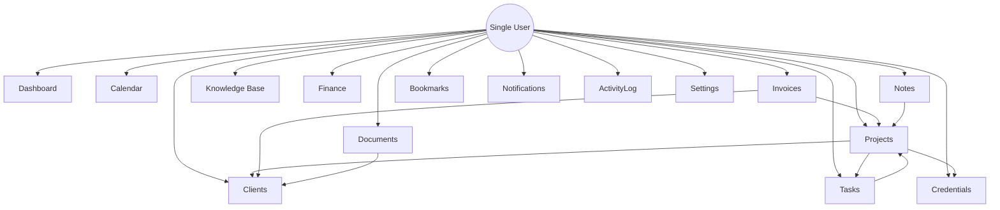

# 8. Information Architecture

```mermaid
graph TD
    User((Single User)) --> Dashboard
    User --> Projects
    User --> Clients
    User --> Tasks
    User --> Calendar
    User --> Notes
    User --> KB[Knowledge Base]
    User --> Documents
    User --> Credentials
    User --> Finance
    User --> Invoices
    User --> Bookmarks
    User --> Notifications
    User --> ActivityLog
    User --> Settings

    %% Relationships between modules
    Projects --> Clients
    Projects --> Tasks
    Projects --> Credentials
    Invoices --> Clients
    Invoices --> Projects
    Tasks --> Projects
    Documents --> Clients
    Notes --> Projects
```
